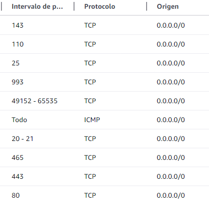

# Practica-daw-3.1

En esta practica realizaremos la instalación de __Plesk__, este es una plataforma software de hosting que permite alojar y administrar sus aplicaciones web.

## Grupos de Seguridad

Para comenzar con la instalación de este, primero debemos de crear un nuevo grupo de seguridad en AWS con los siguientes puestos de entrada abiertos

Para poder contarnos por __ssh, http y https__ abriremos los siguientes puestos

* ``22``: SSH (TCP)
* ``80``: HTTP (TCP)
* ``443``: HTTPS (TCP)
* ``ICMP``

En caso de que vallamos a conectarnos mediante __FTP__

* ``21``: FTP (TCP) - Puerto de control en los modos activo y pasivo
* ``20``: FTP (TCP) - Puerto de datos en el modo activo
* ``49152`` - 65535: Rango de puertos dinámicos para el modo pasivo (TCP)


Puertos para el servicio de correo electrónico

* ``25``: SMTP (TCP)
* ``465``: SMTPS (TCP)
* ``143``: IMAP (TCP)
* ``993``: IMAPS (TCP)
* ``110``: POP3 (TCP)
* ``995``: POP3S (TCP)



## Creación de la instancia

Crearemos una nueva instancia con las siguientes características:

* __Nombre__ ``Plesk``
* __Imagen__ ``Ubuntu``
* __Architecture__ ``x86``
* __Tipo de instancia__ ``t2.medium (2 vCPUs, 4 GB de RAM``
* __Clave secreta__ ``vockey``
* __Grupo de seguridad__ ``Pondremos el grupo de seguridad creado anteriormente``
* __Almacenamiento__ ``30 GB EBS``

Ademas debemos de crear una __ip elástica__ y asociarla a esta nueva instancia

## Instalación de Plesk

Para esto utilizamos un script de bash en el cual realizaremos los siguientes pasos.

En primer lugar actualizaremos la instancia con los siguientes comandos

``` sh
apt update

apt upgrade -y
```

Posteriormente para que no allá conflictos en caso de ya haber instalado plesk en los archivos temporales, lo eliminaremos con el comando ``rm -rf /tmp/plesk-installer``

Ademas debemos de instalar el código fuente de este y cambiar los permisos de este añadiéndole el permiso de ejecución

``` sh
wget https://autoinstall.plesk.com/plesk-installer -P /tmp

chmod +x /tmp/plesk-installer
```

Por ultimo realizaremos la instalación de Plesk con el siguiente comando ``/tmp/plesk-installer install plesk``, esto tardara bastante (10 min aproximadamente), una vez que finalize nos mostrara 2 enlaces, el primero sera para registrar una cuanta y el segundo sera para entrar con una clave sin la necesidad de registrarse.

En caso de no haber abierto ninguno de estos dos enlaces podremos volver a mostrarlos con el siguiente comando ``sudo plesk login``

Si hemos seguido los pasos correctamente, al poner la ip de nuestra instancia deberemos ver la siguiente pantalla


