# Plesk: Creación de dominios, subdominios y distintas formas de desplegar en Plesk

En esta práctica realizaremos la instalación de **Plesk**, una plataforma de software de hosting que permite alojar y administrar aplicaciones web.

## Índice

1. [Grupos de Seguridad](#grupos-de-seguridad)
2. [Creación de la instancia](#creación-de-la-instancia)
3. [Instalación de Plesk](#instalación-de-plesk)
4. [Creación de dominio y despliegue de WordPress](#creación-de-dominio-y-despliegue-de-wordpress)
5. [Creación de subdominios mediante archivos](#creación-de-subdominios-mediante-archivos)
6. [Certificado de Let's Encrypt](#certificado-de-lets-encrypt)
7. [Creación de bases de datos](#creación-de-bases-de-datos)
8. [Despliegue mediante Git](#despliegue-mediante-git)

---

## Grupos de Seguridad

Para comenzar con la instalación de este, primero debemos de crear un nuevo grupo de seguridad en AWS con los siguientes puestos de entrada abiertos

Para poder contarnos por __ssh, http y https__ abriremos los siguientes puestos

* `22: SSH (TCP)
* `80: HTTP (TCP)
* `443: HTTPS (TCP)
* `ICMP

En caso de que vallamos a conectarnos mediante __FTP__

* `21: FTP (TCP) - Puerto de control en los modos activo y pasivo
* `20: FTP (TCP) - Puerto de datos en el modo activo
* `49152 - 65535: Rango de puertos dinámicos para el modo pasivo (TCP)

Puertos para el servicio de correo electrónico

* `25: SMTP (TCP)
* `465: SMTPS (TCP)
* `143: IMAP (TCP)
* `993: IMAPS (TCP)
* `110: POP3 (TCP)
* `995: POP3S (TCP)

## Creación de la instancia

Crearemos una nueva instancia con las siguientes características:

* __Nombre__ `Plesk
* __Imagen__ `Ubuntu
* __Architecture__ `x86
* __Tipo de instancia__ `t2.medium (2 vCPUs, 4 GB de RAM
* __Clave secreta__ `vockey
* __Grupo de seguridad__ `Pondremos el grupo de seguridad creado anteriormente
* __Almacenamiento__ `30 GB EBS

Ademas debemos de crear una __ip elástica__ y asociarla a esta nueva instancia

## Instalación de Plesk

Para esto utilizamos un script de bash en el cual realizaremos los siguientes pasos.

En primer lugar actualizaremos la instancia con los siguientes comandos

sh
apt update

apt upgrade -y

Posteriormente para que no allá conflictos en caso de ya haber instalado plesk en los archivos temporales, lo eliminaremos con el comando `rm -rf /tmp/plesk-installer

Ademas debemos de instalar el código fuente de este y cambiar los permisos de este añadiéndole el permiso de ejecución

sh
wget https://autoinstall.plesk.com/plesk-installer -P /tmp

chmod +x /tmp/plesk-installer

Por ultimo realizaremos la instalación de Plesk con el siguiente comando `/tmp/plesk-installer install plesk, esto tardara bastante (10 min aproximadamente), una vez que finalize nos mostrara 2 enlaces, el primero sera para registrar una cuanta y el segundo sera para entrar con una clave sin la necesidad de registrarse.

En caso de no haber abierto ninguno de estos dos enlaces podremos volver a mostrarlos con el siguiente comando `sudo plesk login

Si hemos seguido los pasos correctamente, al poner la ip de nuestra instancia deberemos ver la siguiente pantalla

## Creación de dominio y despliegue de wordpress

En primer lugar crearemos un dominio, para esto haremos click en el botón azul que pone __Add domain__ y se nos abrirá el siguiente panel para seleccionar lo que queremos desplegar, con el periodo de prueba solo nos permitirá realizar un dominio

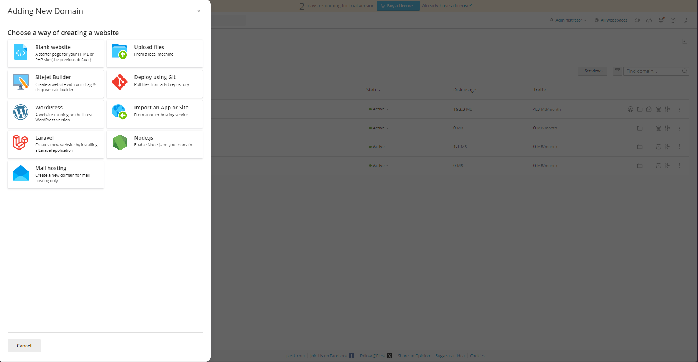

En nuestro caso desplegaremos WordPress, al seleccionar este se nos abrirá la siguiente sección donde pondremos la IP elástica de la instancia seguidamente de `.nip.io 

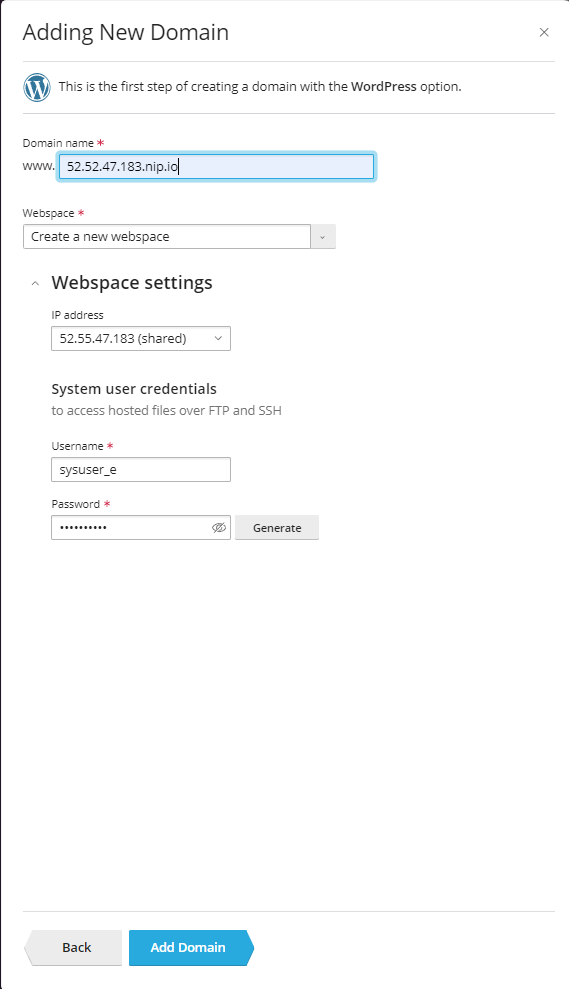

Una vez hecho esto, se abra creado nuestra pagina web de WordPress y si accedemos ha esta ruta se mostrara la web

## Creación de Subdominios mediante archivos

Para esto aremos click en el botón de __Add Subdomain__, posteriormente se nos abrirá un formulario donde podremos el nombre que tendrá nuestro subdominio y le daremos a __OK__, esperamos a que se cree el subdominio y posteriormente seleccionaremos la opción de __File__ y hay subiremos los archivos que necesitemos (Importante: elimina el index que crea por defecto y reemplázalo por el tuyo)

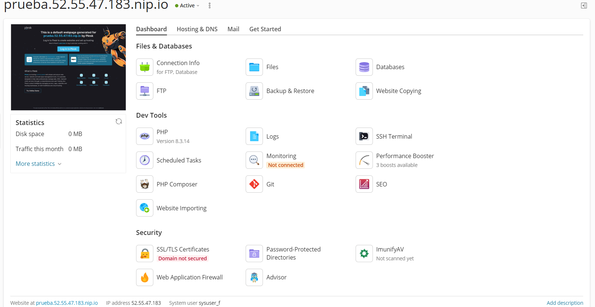

## Certificado de lets encrypt

Para añadir un certificado a un dominio o subdominio debemos de darle a la opción de __SSL/TLS Certificate__ y hay se nos abrirá una ventana donde haremos scroll asta el final y seleccionaremos la siguiente opción

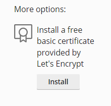

Una vez seleccionado este se nos abrirá una barra lateral donde introduciremos un correo electrónico y le daremos click a __opener nuestro dominio__, esto cargara un par de cosas y de esta forma ya tendremos nuestro certificado de forma gratuita

## Creación de bases de datos

Para crear bases de datos iremos al apartado __Databases__ y hay haremos click a __Add Database__, aquí se nos abrirá una nueva ventana donde podremos introducir el nombre entre otras cosas sobre esta

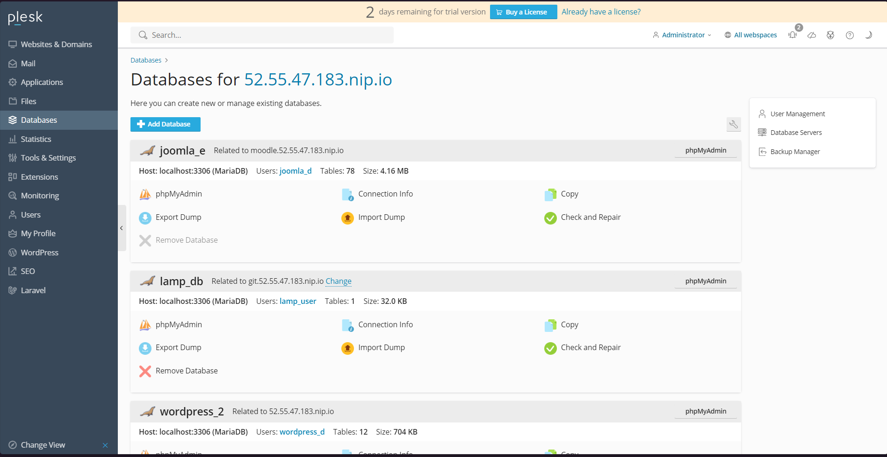

Aquí pondremos el nombre de la base de datos, el username, la contraseña y le daremos ha aceptar, de esta forma ya habremos creado una base de datos

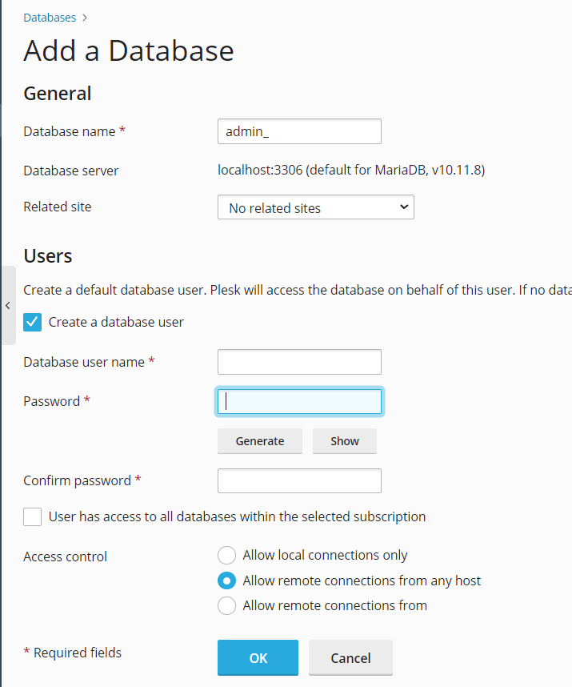

Una vez terminado, podremos acceder a PhpMyAdmin y hay ya creamos las tablas que necesitemos

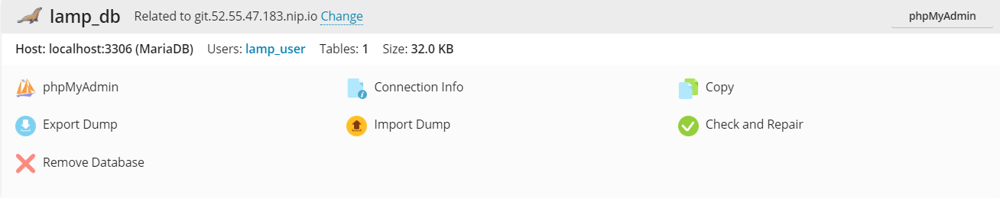

## Despliegue mediante git

Para este crearemos en primer lugar un subdominio y le añadiremos un certificado de lest encrypt, posteriormente en el apartado de __Dashboard__ elegiremos la opción de __git__ y haremos click en el botón que pone __Add repository__, aquí se nos abrirá la siguiente barra lateral

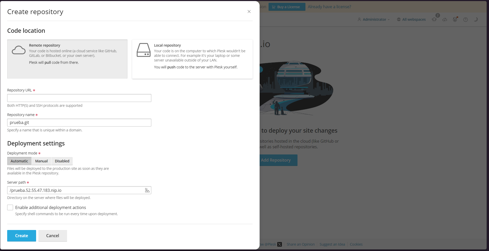

Debemos de poner en el primer campo el url de nuestro repositorio de github que queremos desplegar, aquí debemos de copiar el enlace por __SSH__ no por HTTPS

### Añadir calve SSH a GitHub

Posteriormente comparemos __SSH public key content__ y iremos a los ajustes de nuestra cuenta de GitHub y en el apartado de __SSH and GPG Key__ le daremos a __New SSH Key__

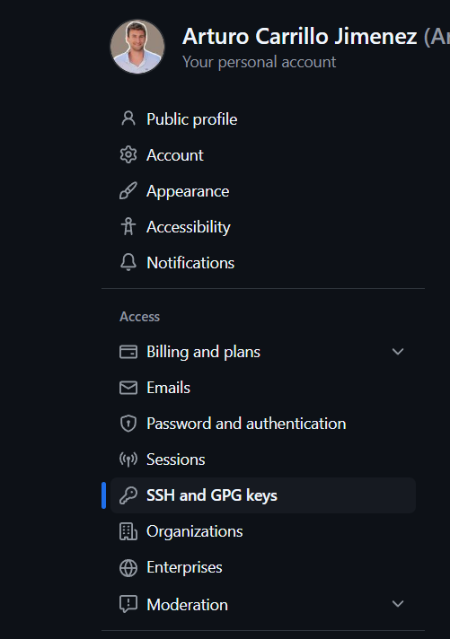

Hay se nos abrirá una ventana con dos campos, el titulo que pondremos lo que queramos y el segundo (Key) que pondremos hay nuestra clave que hemos copiado anteriormente

### Añadir Webhook

Para esto copiaremos el enlace que nos mostrara en el formulario de cuando añadimos el repo de git, nos vamos a la configuración del repositorio y en el apartado de Webhook añadimos el link de este y le damos ha guardar

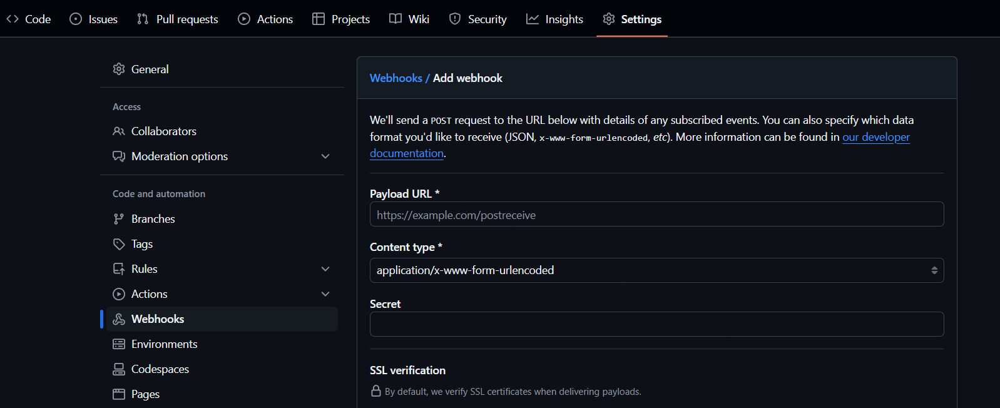

### Conectar una base de datos

Por ultimo seleccionaremos el siguiente apartado que nos abrirá un campo de texto y donde pondremos los siguientes comandos para conectar una base de datos a nuestro despliegue

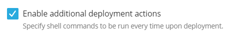

sh
#!/bin/bash
sed -i "s/database_name_here/lamp_db/" src/config.php
sed -i "s/username_here/lamp_user/" src/config.php
sed -i "s/password_here/Lh8m!f015/" src/config.php

De esta forma ya tendríamos hecho nuestro despliega mediante git