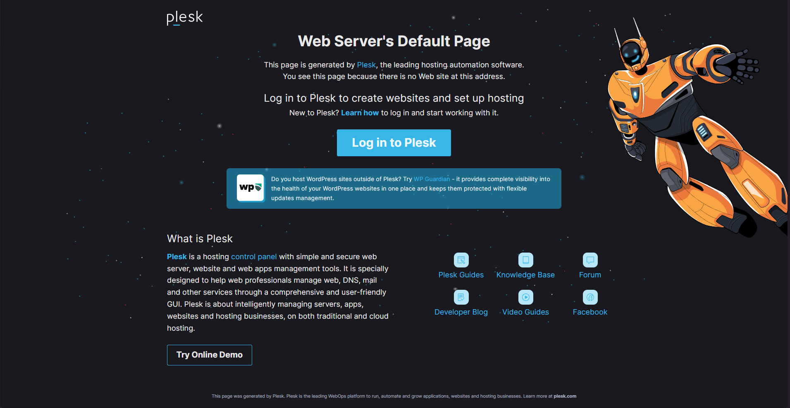

# Plesk: Creación de dominios, subdominios y distintas formas de desplegar en Plesk

En esta práctica realizaremos la instalación de **Plesk**, una plataforma de software de hosting que permite alojar y administrar aplicaciones web.

## Índice

1. [Grupos de Seguridad](#grupos-de-seguridad)
2. [Creación de la instancia](#creación-de-la-instancia)
3. [Instalación de Plesk](#instalación-de-plesk)
4. [Creación de dominio y despliegue de WordPress](#creación-de-dominio-y-despliegue-de-wordpress)
5. [Creación de subdominios mediante archivos](#creación-de-subdominios-mediante-archivos)
6. [Certificado de Let's Encrypt](#certificado-de-lets-encrypt)
7. [Creación de bases de datos](#creación-de-bases-de-datos)
8. [Despliegue mediante Git](#despliegue-mediante-git)

---

## Grupos de Seguridad

Para comenzar con la instalación, primero debemos crear un nuevo grupo de seguridad en AWS con los siguientes puertos de entrada abiertos:

Para conectarnos por **SSH, HTTP y HTTPS**:
- `22`: SSH (TCP)
- `80`: HTTP (TCP)
- `443`: HTTPS (TCP)
- `ICMP`

En caso de usar **FTP**:
- `21`: FTP (TCP) - Puerto de control (modos activo y pasivo)
- `20`: FTP (TCP) - Puerto de datos (modo activo)
- `49152-65535`: Rango de puertos dinámicos (modo pasivo, TCP)

Puertos para el servicio de correo electrónico:
- `25`: SMTP (TCP)
- `465`: SMTPS (TCP)
- `143`: IMAP (TCP)
- `993`: IMAPS (TCP)
- `110`: POP3 (TCP)
- `995`: POP3S (TCP)


---

## Creación de la instancia

Crearemos una nueva instancia con las siguientes características:

- **Nombre**: `Plesk`
- **Imagen**: `Ubuntu`
- **Arquitectura**: `x86`
- **Tipo de instancia**: `t2.medium (2 vCPUs, 4 GB de RAM)`
- **Clave secreta**: `vockey`
- **Grupo de seguridad**: Usaremos el grupo creado anteriormente
- **Almacenamiento**: `30 GB EBS`

Además, debemos crear una **IP elástica** y asociarla a esta nueva instancia.

---

## Instalación de Plesk

Para instalar Plesk, utilizaremos un script en Bash:

1. Actualizamos la instancia:
   ```sh
   apt update
   apt upgrade -y
   ```

2. Eliminamos archivos temporales en caso de conflictos:
   ```sh
   rm -rf /tmp/plesk-installer
   ```

3. Descargamos el instalador y configuramos permisos de ejecución:
   ```sh
   wget https://autoinstall.plesk.com/plesk-installer -P /tmp
   chmod +x /tmp/plesk-installer
   ```

4. Instalamos Plesk:
   ```sh
   /tmp/plesk-installer install plesk
   ```

   Este proceso tomará unos 10 minutos. Una vez finalizado, se mostrarán dos enlaces:
   - Para registrar una cuenta.
   - Para acceder con una clave sin registro.

Si necesitas volver a mostrar estos enlaces, usa el siguiente comando:
```sh
sudo plesk login
```

Si todo está correcto, al ingresar la IP de la instancia deberías ver la siguiente pantalla:



---

## Creación de dominio y despliegue de WordPress

1. Haz clic en el botón **Add Domain**.
   

2. Selecciona WordPress como aplicación para desplegar.
   

3. Introduce la IP elástica seguida de `.nip.io`:
   

Una vez completado este proceso, tu página web de WordPress estará lista y podrás acceder a través de la URL configurada.


---

## Creación de subdominios mediante archivos

1. Haz clic en el botón **Add Subdomain**.

2. Completa el formulario con el nombre del subdominio y haz clic en **OK**.

3. Una vez creado el subdominio, selecciona la opción **File** para subir los archivos necesarios.
   - **Importante**: Elimina el archivo `index` generado por defecto y reemplázalo con el tuyo.


---

## Certificado de Let's Encrypt

Para añadir un certificado SSL/TLS:

1. Ve a la opción **SSL/TLS Certificate**.

2. Haz scroll hasta el final y selecciona **Let's Encrypt**.


3. Introduce un correo electrónico y haz clic en **Get it free**.

Esto generará un certificado SSL gratuito para tu dominio o subdominio.

---

## Creación de bases de datos

1. Ve a la sección **Databases** y haz clic en **Add Database**.

2. Completa el formulario con:
   - Nombre de la base de datos.
   - Nombre de usuario.
   - Contraseña.

3. Haz clic en **OK** para crear la base de datos.

Una vez creada, podrás acceder a **phpMyAdmin** para gestionar tablas y datos.


---

## Despliegue mediante Git

1. Crea un subdominio y añádele un certificado de Let's Encrypt.

2. En el **Dashboard**, selecciona **Git** y haz clic en **Add Repository**.
   

3. Completa el formulario con:
   - La URL del repositorio (usa el enlace SSH, no HTTPS).

### Añadir clave SSH a GitHub

1. Copia el contenido de la clave pública SSH generada.

2. Ve a los ajustes de GitHub, en la sección **SSH and GPG Keys**, y selecciona **New SSH Key**.
   

3. Introduce un título y pega la clave copiada.

### Añadir Webhook

1. Copia el enlace generado en el formulario del repositorio.

2. Ve a la configuración del repositorio en GitHub y en la sección **Webhook**, añade el enlace y guarda los cambios.
   

### Conectar una base de datos

En el apartado de despliegue, agrega los siguientes comandos para conectar la base de datos:

```sh
#!/bin/bash
sed -i "s/database_name_here/lamp_db/" src/config.php
sed -i "s/username_here/lamp_user/" src/config.php
sed -i "s/password_here/Lh8m!f015/" src/config.php
```

De esta forma, el despliegue mediante Git estará completado.

